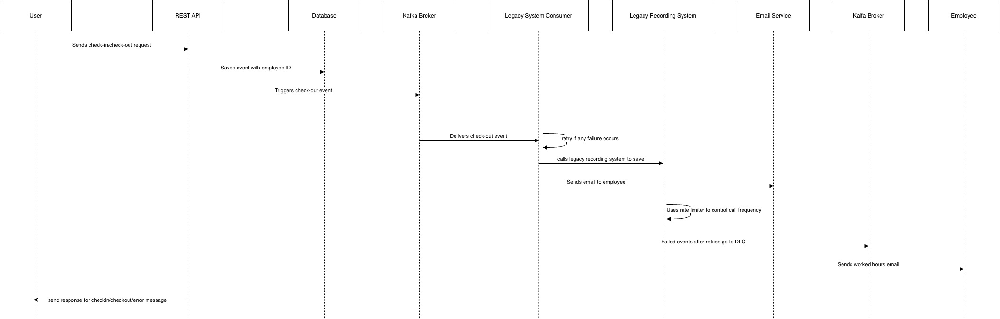

## Overview
The Check-in Service is a backend application built using **Java, Spring Boot, and Apache Kafka** to handle employee clock-in and clock-out events in a factory.  
Card readers at the factory entrance call a single REST API to record attendance. After an employee checks out, the service calculates the worked hours and reports them to the company’s legacy labor cost recording system.

The main focus of the design is to keep user interactions fast while ensuring reliability, fault tolerance, and zero loss of attendance data.

## Requirements
The system provides one simple REST endpoint that accepts an `employeeId` and decides whether the action is a check-in or check-out based on the latest attendance record.  
All working times are stored in the service database and treated as the source of truth.

Since the legacy recording system is slow and unreliable, user actions are completely separated from third-party API calls. This ensures that card readers are not blocked by network delays or retries.

## Architecture Diagram

# Design Questions & Answers

## 1. How is user action (check-in/check-out) separated from third-party API calls?

I have separated user actions (check-in/check-out) from third-party API calls by publishing events to Kafka asynchronously.

- When a user checks out, the API immediately updates the database and sends a `CheckOutEventPayload` to the Kafka topic **without waiting for the legacy system to process it**.
- This ensures that the user gets a **fast response** (`Checked In` or `Checked Out`) and is **not blocked** by background processing or any delays from the legacy system.

---

## 2. Explain how you would ensure consistency, handle errors and retries, and what you would do with messages that keep failing

- The **database acts as the source of truth** for employee attendance, meaning all check-in and check-out events are first recorded reliably in the DB.
- To ensure consistency with downstream systems, such as Kafka, we can implement **retries using Spring’s `@Retryable`** on both the publisher and consumer sides.
- If a message fails repeatedly beyond a configurable maximum number of attempts, it is sent to a **Dead Letter Queue (DLQ)** for investigation and reprocessing.

---

## 3. Suggest ways to deal with rate limits and outages of the recording system

- Use **Kafka queues** to buffer incoming requests and handle high traffic efficiently.
- Increase the number of **consumers** or scale the service horizontally (more **pods**) to process requests faster.
- Apply **backpressure** to slow down request intake when the system is saturated.
- **Client-side rate limiting** is another option, though it may affect the speed perceived by users.
- Temporarily **stop sending requests** to a failing system to allow it to recover, preventing further overload and ensuring system stability.

---

## 4. How you would monitor and trace what happens to each message and how you would handle changes to the message format over time

- To monitor and trace each message, we can use **correlation IDs** stored in both the database and Kafka messages.
- This allows tracking the **full lifecycle of each event** across services.
- Additionally, **MDC logging** combined with distributed tracing tools like **Spring Sleuth** can provide **end-to-end visibility** into message flow, processing times, and failures.

**Handling changes to message format over time:**

- Use **versioning** for messages.
- Keep messages as **structured classes** so new fields can be added without breaking existing consumers.
- On the consumer side, using **`@JsonIgnoreProperties(ignoreUnknown = true)`** ensures additional fields are safely ignored, maintaining backward compatibility.
- Optionally, **validate schemas** and **transform older versions** to the latest format, ensuring smooth upgrades across services.

## Detailed Flow

1. **User Interaction**

The process begins when a user (employee) scans their card at the factory entrance or exit.

This sends a check-in/check-out request to the REST API.

2. **REST API Handling**

The CheckInController receives the request with the employee ID.

The API communicates with the Database to check the employee’s last attendance record.

Depending on the state:

If the employee is not checked in, a new check-in record is created.

If the employee is already checked in, the record is updated with the check-out timestamp.

3. **Event Triggering**

After a check-out, the system creates a CheckOutEventPayload containing:

Employee ID

Worked hours

Email

Payload version

This event is published asynchronously to Kafka (check-out-events topic) for further processing.

4. **Kafka Consumer (Legacy System Consumer)**

The LegacySystemCheckOutConsumer listens to the check-out-events topic.

For each event:

It calls the legacy labor cost recording system to log hours worked.

It applies rate limiting to avoid overwhelming the legacy system.

It sends an email to the employee with their worked hours.

5. **Error Handling and Retry**

If the legacy system call or email sending fails, the consumer retries automatically up to a configurable limit.

All retry logic is handled asynchronously without blocking the API.

6. **Dead Letter Queue (DLQ)**

If the event fails even after all retries, it is sent to the Dead Letter Queue (check-out-events.DLQ).

These events can be reviewed and reprocessed manually later.

7. **Response to User**

The REST API finally sends a response to the user:

"Checked In" if it was a check-in

"Checked Out" if it was a check-out

Or an error message if something went wrong

